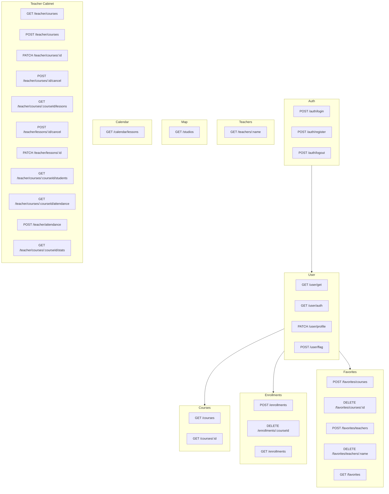

# Методы API для бэкенда

На основе страниц и кода фронтенда (MockDb, stores, страницы) ниже перечислены методы, которые нужно реализовать на бэкенде.

---

## 1. Авторизация (AuthPage)

| Метод | Путь             | Описание                                 | Тело запроса                                                             | Ответ                                 |
| ----- | ---------------- | ---------------------------------------- | ------------------------------------------------------------------------ | ------------------------------------- |
| POST  | `/auth/login`    | Вход                                     | `{ email, password }`                                                    | `{ user: UserServer, token: string }` |
| POST  | `/auth/register` | Регистрация                              | `{ firstName, lastName, email, password, phone?, city?, level?, role? }` | `{ user: UserServer, token: string }` |
| POST  | `/auth/logout`   | Выход (опционально — инвалидация токена) | —                                                                        | `{ success: boolean }`                |

**Типы:** см. [src/store/globals/user/types.ts](src/store/globals/user/types.ts) — `UserServer`, `ApiAuthType`.

---

## 2. Пользователь (ProfilePage — профиль, UserStore)

| Метод | Путь            | Описание                           | Заголовки                       | Ответ                          |
| ----- | --------------- | ---------------------------------- | ------------------------------- | ------------------------------ |
| GET   | `/user/get`     | Текущий пользователь               | `Authorization: Bearer <token>` | `{ user: UserServer }`         |
| GET   | `/user/auth`    | Валидация токена / проверка сессии | `Authorization: Bearer <token>` | `{ user: UserServer }` или 401 |
| PATCH | `/user/profile` | Обновление профиля                 | Bearer                          | `{ user: UserServer }`         |
| POST  | `/user/flag`    | Обновление флагов                  | `{ name, value }`               | —                              |

**Обновляемые поля профиля:** `firstName`, `lastName`, `phone`, `city`, `level`, `avatar` (см. `MockDb.updateProfile`).

---

## 3. Курсы (HomePage, CoursePage, TeacherPage)

| Метод | Путь           | Описание                    | Query params                                                                                                                                                                | Ответ                                |
| ----- | -------------- | --------------------------- | --------------------------------------------------------------------------------------------------------------------------------------------------------------------------- | ------------------------------------ |
| GET   | `/courses`     | Список курсов с фильтрацией | `types[]`, `levels[]`, `teachers[]`, `studios[]`, `cities[]`, `weekdays[]`, `dateFrom`, `dateTo`, `timeFrom`, `timeTo`, `priceFrom`, `priceTo`, `search`, `page`, `perPage` | `{ items: Course[], total: number }` |
| GET   | `/courses/:id` | Курс по id                  | —                                                                                                                                                                           | `Course`                             |

**Фильтры:** см. [src/store/FiltersStore](src/store/FiltersStore/FiltersStore.ts) и [src/pages/HomePage/components/Filters/types.ts](src/pages/HomePage/components/Filters/types.ts).

**Структура Course:** [src/config/cards.ts](src/config/cards.ts) — `CourseConfigItem` (name, type, teacher, level, dateFrom, dateTo, price, studio, city, spotsLeft, schedule, и т.д.).

---

## 4. Преподаватели (TeacherPage, ProfilePage — карточки)

| Метод | Путь              | Описание                             | Ответ                                     |
| ----- | ----------------- | ------------------------------------ | ----------------------------------------- |
| GET   | `/teachers/:name` | Преподаватель по имени (URL-encoded) | `{ teacher: Teacher, courses: Course[] }` |

**Teacher:** name, bio, images, achievements, experience, specializations, rating, reviews ([config/cards.ts](src/config/cards.ts)).

---

## 5. Записи на курсы (CoursePage, ProfilePage — вкладка «Записи»)

| Метод  | Путь                     | Описание           | Ответ                         |
| ------ | ------------------------ | ------------------ | ----------------------------- |
| POST   | `/enrollments`           | Записаться на курс | `{ courseId }` → `Enrollment` |
| DELETE | `/enrollments/:courseId` | Отменить запись    | `{ success: boolean }`        |
| GET    | `/enrollments`           | Мои записи         | `Enrollment[]`                |

**Enrollment:** [config/users.ts](src/config/users.ts) — `courseId`, `enrolledAt`, `status`, `paid`.

---

## 6. Избранное (ProfilePage — Favorites, CoursePage, TeacherPage)

| Метод  | Путь                           | Описание                  | Тело              | Ответ                                             |
| ------ | ------------------------------ | ------------------------- | ----------------- | ------------------------------------------------- |
| POST   | `/favorites/courses`           | Добавить курс в избранное | `{ courseId }`    | —                                                 |
| DELETE | `/favorites/courses/:courseId` | Убрать курс из избранного | —                 | —                                                 |
| POST   | `/favorites/teachers`          | Добавить преподавателя    | `{ teacherName }` | —                                                 |
| DELETE | `/favorites/teachers/:name`    | Убрать преподавателя      | —                 | —                                                 |
| GET    | `/favorites`                   | Моё избранное             | —                 | `{ courseIds: number[], teacherNames: string[] }` |

Альтернатива: один метод `PATCH /favorites` с телом `{ courseIds[], teacherNames[] }` для синхронизации.

---

## 7. Студии и карта (MapPage)

| Метод | Путь       | Описание      | Query params                                                 | Ответ          |
| ----- | ---------- | ------------- | ------------------------------------------------------------ | -------------- |
| GET   | `/studios` | Список студий | `cities[]`, `metro[]`, `studios[]`, `danceTypes[]`, `search` | `StudioData[]` |

**StudioData:** [src/pages/MapPage/config.ts](src/pages/MapPage/config.ts) — id, name, address, metro, city, lat, lng, image, courses[].

---

## 8. Календарь (CalendarPage)

| Метод | Путь                | Описание            | Query params                         | Ответ                            |
| ----- | ------------------- | ------------------- | ------------------------------------ | -------------------------------- |
| GET   | `/calendar/lessons` | Уроки для календаря | `courseIds[]?`, `from`, `to`, `mode` | `Lesson[]` или события календаря |

**Режимы фильтрации:** все курсы пользователя / все курсы преподавателя / выбранный курс (см. [CalendarPageStore](src/store/CalendarPageStore/CalendarPageStore.ts)).

**Lesson:** [config/teacher.ts](src/config/teacher.ts) — id, courseId, date, timeFrom, timeTo, location, status.

---

## 9. Личный кабинет преподавателя (ProfilePage — teacher view)

### 9.1 Курсы преподавателя

| Метод | Путь                          | Описание                     | Тело                      | Ответ                  |
| ----- | ----------------------------- | ---------------------------- | ------------------------- | ---------------------- |
| GET   | `/teacher/courses`            | Курсы текущего преподавателя | —                         | `TeacherCourse[]`      |
| POST  | `/teacher/courses`            | Создать курс                 | `CourseFormData`          | `TeacherCourse`        |
| PATCH | `/teacher/courses/:id`        | Редактировать курс           | `Partial<CourseFormData>` | `TeacherCourse`        |
| POST  | `/teacher/courses/:id/cancel` | Отменить курс                | —                         | `{ success: boolean }` |

**CourseFormData:** name, type, level, dateFrom, dateTo, price, studio, city, description, capacity, schedule[].

### 9.2 Уроки

| Метод | Путь                                 | Описание      | Ответ                                          |
| ----- | ------------------------------------ | ------------- | ---------------------------------------------- |
| GET   | `/teacher/courses/:courseId/lessons` | Уроки курса   | `Lesson[]`                                     |
| POST  | `/teacher/lessons/:id/cancel`        | Отменить урок | `{ success: boolean }`                         |
| PATCH | `/teacher/lessons/:id`               | Изменить урок | `{ timeFrom?, timeTo?, location? }` → `Lesson` |

### 9.3 Ученики и посещаемость

| Метод | Путь                                    | Описание                | Ответ                              |
| ----- | --------------------------------------- | ----------------------- | ---------------------------------- |
| GET   | `/teacher/courses/:courseId/students`   | Ученики курса           | `UserServer[]` (без пароля)        |
| GET   | `/teacher/courses/:courseId/attendance` | Посещаемость по курсу   | `AttendanceRecord[]`               |
| POST  | `/teacher/attendance`                   | Отметить посещаемость   | `{ lessonId, studentId, present }` |
| GET   | `/teacher/courses/:courseId/stats`      | Статистика посещаемости | `AttendanceStats`                  |

**Query для stats:** `periodFrom`, `periodTo`, `comparePeriodFrom`, `comparePeriodTo` (опционально для сравнения периодов).

**AttendanceStats:** [config/teacher.ts](src/config/teacher.ts) — totalLessons, conductedLessons, cancelledLessons, avgAttendancePercent, totalStudents, perLesson[], perStudent[].

---

## 10. Дополнительные (по текущим endpoints)

| Метод | Путь            | Описание                                                        |
| ----- | --------------- | --------------------------------------------------------------- |
| POST  | `/user/restart` | Сброс (reset) — см. [endpoints.ts](src/config/api/endpoints.ts) |

---

## Сводная схема

---

## Рекомендации

1. **Авторизация:** JWT в заголовке `Authorization: Bearer <token>` — уже используется во фронте ([ApiStore](src/store/globals/api/ApiStore.ts)).
2. **Базовый URL:** `/api/` (см. [apiUrl.ts](src/config/api/apiUrl.ts)).
3. **Ошибки:** формат `{ code?, message?, status? }` (тип `ErrorResponse` в [store/globals/api/types.ts](src/store/globals/api/types.ts)).
4. **Пагинация:** для `GET /courses` — `page`, `perPage` (на фронте 6 или 9 на мобиле/десктопе).
5. **Поиск:** для HomePage и MapPage — `search` (text search по названию, адресу и т.д.).

